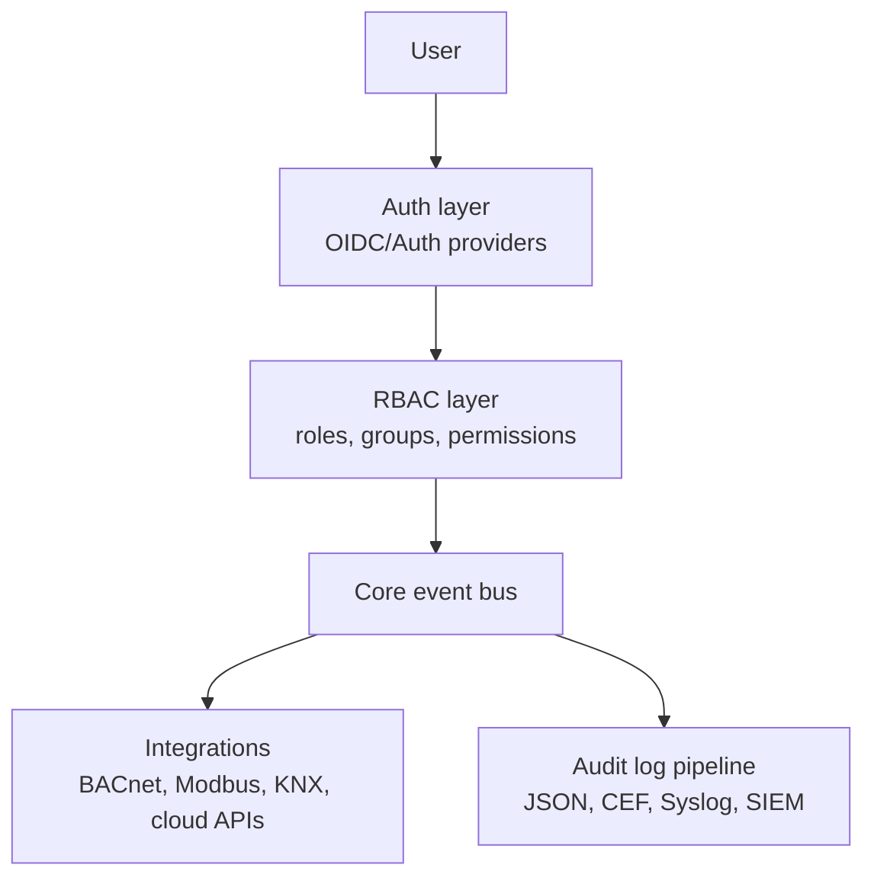

# Home Assistant Core
## Enterprise contribution strategy
### Fortune 500 readiness

**Repository:** `felipeofdev-ai/core`  
**Upstream fork target:** `home-assistant/core`  
**Date:** February 2026

---

## Institutional objective

This strategy defines a structured initiative to improve Home Assistant Core enterprise readiness through high-impact upstream-oriented contributions.

### Target audience

- Contributors (new and experienced)
- Maintainers and code owners
- Security and architecture teams
- Enterprise adopters in facilities and OT

### Scope

- **Fork scope (`felipeofdev-ai/core`)**: implementation sandbox, validation, and iteration
- **Upstream scope (`home-assistant/core`)**: primary destination for merged value
- **Operating principle**: minimize long-term fork drift and prioritize upstream-compatible changes

### Non-goals

- This is not a long-term divergent fork strategy
- This is not a closed commercial product plan
- This does not replace Open Home Foundation governance
- This does not introduce breaking changes without ADR-level discussion

---

## Strategic execution backlog (issues)

| Proposed issue | Type | Expected outcome |
|---|---|---|
| `Implement OIDC auth provider` | Core feature | Functional proof of concept + rollout path |
| `Propose RBAC user groups ADR` | Architecture | Recorded and reviewed design decision |
| `Elevate Modbus to Gold quality` | Quality scale | Gold rules completed with tests |
| `Enterprise audit log design` | Compliance/security | Data model, retention, and export design |

---

## Reference architecture

---

## Expected impact

- Reduce enterprise authentication and governance blockers
- Increase adoption in facilities management and building automation
- Increase enterprise-related merged PR volume
- Attract new maintainers in security and industrial integrations

---

## Portuguese version

For local/internal strategic use, see:

- `HOME_ASSISTANT_CORE_PLANO_ESTRATEGICO_FORTUNE_500.md`
