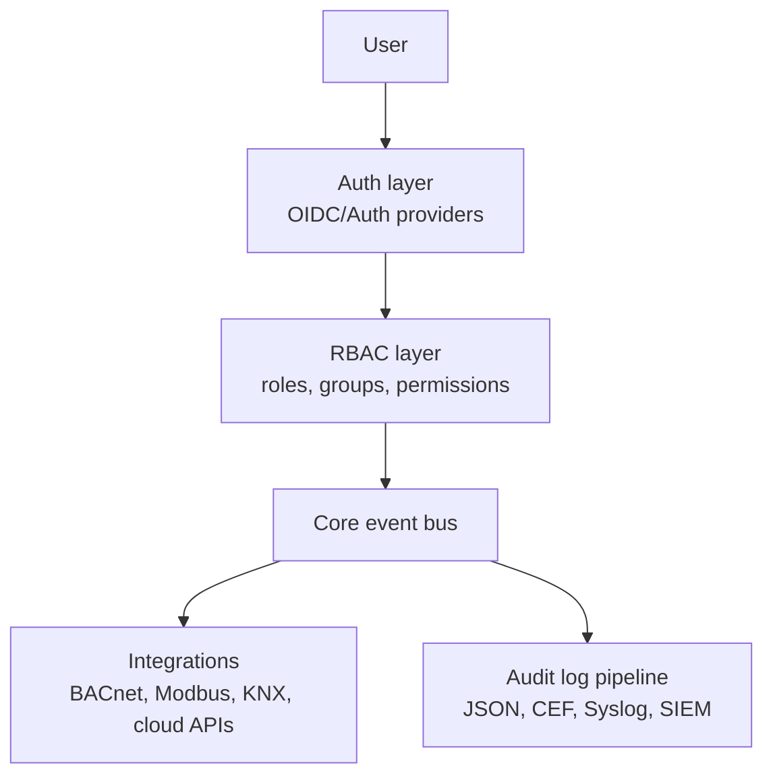

# Home Assistant Core
## Plano estratégico de contribuição
### Nível Fortune 500

**Repositório:** `felipeofdev-ai/core`  
**Fork de:** `home-assistant/core`  
**Data:** fevereiro de 2026

---

## Objetivo institucional

Este plano define uma iniciativa estratégica para elevar o nível de prontidão enterprise do Home Assistant Core por meio de contribuições técnicas de alto impacto, alinhadas ao processo oficial do projeto.

### Público-alvo

- Contributors técnicos (novos e experientes)
- Maintainers e code owners do ecossistema Home Assistant
- Times de arquitetura e segurança
- Enterprise adopters (facilities, OT, TI corporativa)

### Escopo

- **Fork (`felipeofdev-ai/core`)**: ambiente de desenvolvimento, prototipação e validação incremental
- **Upstream (`home-assistant/core`)**: destino principal das contribuições via PRs e discussões de arquitetura
- **Princípio operacional**: reduzir divergência de fork e priorizar mudanças que possam ser absorvidas no upstream

### Non-goals

- Não criar um fork divergente de longo prazo
- Não transformar o plano em produto comercial fechado
- Não substituir a governança oficial da Open Home Foundation
- Não introduzir breaking changes sem ADR/discussão arquitetural prévia

---

## 1. Contexto e oportunidade

O Home Assistant Core é o maior projeto open source de automação residencial do mundo, com mais de 2 milhões de usuários ativos e mais de 3.400 integrações oficiais. O projeto é mantido pela Open Home Foundation.

Este documento detalha o plano completo para tornar o fork `felipeofdev-ai/core` uma referência de contribuição de alto nível, alinhada aos requisitos de ambientes Fortune 500, com foco em segurança empresarial, escalabilidade, qualidade de código e integrações críticas.

### 1.1 Por que o Home Assistant ainda não é Fortune 500 nativo

Apesar da maturidade técnica, o Home Assistant tem lacunas que bloqueiam a adoção corporativa em grande escala:

| Lacuna atual | Impacto corporativo | Oportunidade |
|---|---|---|
| SSO/OIDC nativo ausente | Bloqueador para TI corporativa (Okta, Azure AD, Keycloak) | Alta - 900+ upvotes no GitHub |
| RBAC granular limitado | Sem controle de acesso por departamento ou área | Alta - sem grupos de usuários |
| Audit log insuficiente | Requisito de compliance (SOX, ISO 27001, LGPD) | Média-alta |
| Alta disponibilidade ausente | Indisponibilidade em falha de nó único | Alta - crítica para OT/facilities |
| BACnet/Modbus básico | Protocolo padrão em HVAC e BMS industrial | Alta - pouco explorada |
| API sem rate limiting | Risco de segurança em integração ERP e SCADA | Média |

---

## 2. Sistema de qualidade do Home Assistant

O Home Assistant usa um Integration Quality Scale com quatro níveis (tiers) que definem os padrões mínimos aceitos em PRs. Para contribuições de alto impacto, toda integração deve chegar ao nível Platinum.

### 2.1 Os quatro níveis de qualidade

| Nível | Requisitos principais | Quando usar |
|---|---|---|
| Bronze (base) | Setup via UI, testes de configuração, tipagem básica, documentação básica | Mínimo para qualquer PR aceito |
| Silver | + tratamento de erros robusto, reconexão automática, dispositivos offline | Para PRs de bugfix e melhoria |
| Gold | + config flow completo, actions tipadas, testes abrangentes, entity descriptions | Padrão para novas integrações |
| Platinum | + 100% async, typing completo, código comentado, performance otimizada | Requerido para programa Works with Home Assistant |

### 2.2 O arquivo `quality_scale.yaml`

Toda integração subindo de nível precisa de um arquivo `quality_scale.yaml` rastreando o progresso de cada regra:

```yaml
rules:
  action-exceptions: done
  config-flow: done
  test-coverage: todo
  async-dependency: todo
```

---

## 3. Setup técnico do ambiente

Antes de qualquer contribuição, o ambiente local precisa estar configurado corretamente. O Home Assistant usa Python 3.13+, mypy strict, ruff para linting e pytest com cobertura exigida.

### 3.1 Configuração inicial do fork

| Ação | Comando |
|---|---|
| Clonar o fork | `git clone https://github.com/felipeofdev-ai/core` |
| Adicionar upstream | `git remote add upstream https://github.com/home-assistant/core` |
| Sincronizar com upstream | `git fetch upstream && git rebase upstream/dev` |
| Instalar dependências | `pip install -r requirements_test_all.txt` |
| Rodar testes | `pytest tests/ -x --timeout=60` |
| Type check | `mypy homeassistant/components/[integracao]/` |
| Linting | `ruff check homeassistant/ && ruff format homeassistant/` |
| Pre-commit hooks | `pre-commit install && pre-commit run --all-files` |
| Validar manifests | `python script/hassfest validate` |

### 3.2 Estrutura de branches

| Tipo de branch | Propósito | Exemplo |
|---|---|---|
| `feature/[nome]` | Nova integração ou funcionalidade | `feature/oidc-auth-provider` |
| `fix/[numero-issue]` | Bugfix com referência ao issue | `fix/153752-startup-hang` |
| `quality/[integracao]-[nivel]` | Elevação de quality scale | `quality/mqtt-platinum` |
| `enterprise/[nome]` | Feature específica para empresas | `enterprise/rbac-user-groups` |
| `docs/[integracao]` | Melhorias de documentação | `docs/bacnet-setup-guide` |

### 3.3 Checklist de PR (padrão Home Assistant)

- Todos os testes passando (`pytest` sem falhas)
- Cobertura de testes >= 95% para novas integrações
- `mypy` sem erros no módulo alterado
- `ruff check` e `ruff format` sem issues
- Entrada no changelog da integração
- Strings de tradução em `strings.json` atualizadas
- Documentação atualizada ou PR separado em `home-assistant.io`
- `quality_scale.yaml` atualizado, quando aplicável

---

## 4. Roadmap de contribuição (18 meses)

O plano está dividido em três fases progressivas. Cada fase constrói a credibilidade necessária para a próxima, culminando em contribuições arquiteturais de impacto Fortune 500.

### 4.1 Visão geral das fases

| Fase | Período | Foco | Entregáveis | Meta |
|---|---|---|---|---|
| Fase 1 | Meses 1-4 | Credibilidade e quick wins | 5-10 PRs merged, bugs corrigidos, quality upgrades | Reconhecimento como contributor ativo |
| Fase 2 | Meses 5-10 | Integrações enterprise | SSO, RBAC, BACnet, audit log | Code owner em integrações-chave |
| Fase 3 | Meses 11-18 | Arquitetura e liderança | ADRs aceitos, features core, menção no roadmap oficial | Top 20 contributors |

### 4.2 Fase 1: credibilidade e quick wins (meses 1 a 4)

#### 4.2.1 Issues de alto valor para atacar

Procure issues marcados como bug ou com muitos upvotes sem PR aberto.

| Tipo de issue | Onde encontrar | Valor |
|---|---|---|
| Bugs em integrações populares | `issues?q=is:open+label:bug` | Alto - visibilidade imediata |
| Melhorias de performance | Issues com label `performance` | Alto - impacto mensurável |
| Type hints faltando | Mypy failures em módulos sem tipo | Médio - base sólida |
| Testes ausentes | Integrações com coverage < 80% | Médio - fácil de atacar |

#### 4.2.2 Quality scale upgrades

Estratégia poderosa: escolher 2-3 integrações ativas em Bronze e elevá-las para Gold.

- Encontre integrações em `developers.home-assistant.io` e filtre por `quality_scale: bronze`
- Verifique se há code owner ativo no arquivo `CODEOWNERS`
- Abra uma issue anunciando a intenção de elevar o nível
- Implemente as regras faltantes seguindo o checklist oficial
- Abra PR com o `quality_scale.yaml` completo e atualizado

### 4.3 Fase 2: integrações enterprise (meses 5 a 10)

#### Prioridade 1: SSO e OIDC authentication provider

Feature request com maior demanda represada do projeto. Em 2026 ainda não há OIDC nativo no Home Assistant.

**Abordagem técnica:**

- Implementar como auth provider em `homeassistant/auth/providers/oidc.py`
- Suporte ao fluxo Authorization Code com PKCE (RFC 7636)
- Compatibilidade com Keycloak, Okta, Azure AD, Authelia, Authentik e Pocket ID
- Discovery via `/.well-known/openid-configuration`
- Token refresh automático e gestão de sessão
- Fallback gracioso para autenticação local se OIDC falhar
- Testes em `tests/auth/providers/test_oidc.py`
- Discussão ativa: `github.com/home-assistant/architecture/issues/832`

#### Prioridade 2: RBAC e grupos de usuários

O sistema atual possui dois perfis: admin e usuário. Para Fortune 500, é necessário controle granular.

- Propor ADR formal em `home-assistant/architecture` para user groups
- Implementar modelo de grupos em `homeassistant/auth/`
- Integrar com dashboards (visibilidade por grupo)
- Integrar com entities (controle por grupo)
- Criar interface de gestão de grupos nas configurações

#### Prioridade 3: integrações industriais BACnet e Modbus

Protocolos críticos para automação predial corporativa (HVAC, iluminação, controle de acesso físico).

| Integração | Estado atual | Meta |
|---|---|---|
| BACnet | Básico via terceiros | Integração nativa core com quality gold |
| Modbus | Presente mas limitado (silver) | Elevação para gold e depois platinum |
| KNX | Boa qualidade, faltam features | Completar requisitos platinum |
| DALI | Ausente no core | Nova integração lighting industrial |
| OPC-UA | Ausente | Nova integração SCADA e PLC enterprise |

#### Prioridade 4: audit log e compliance

Empresas com requisitos SOX, ISO 27001 e LGPD precisam rastrear quem fez o quê e quando.

- Implementar log persistente de ações de usuários
- Exportação em formatos padrão: JSON, CEF, Syslog
- Integração com SIEM via webhook ou REST
- Retenção configurável de logs
- Busca e filtros na interface do usuário

### 4.4 Fase 3: arquitetura e liderança (meses 11 a 18)

#### Alta disponibilidade

- Propor ADR formal em `home-assistant/architecture`
- Estado compartilhado via Redis ou banco externo
- Failover automático com heartbeat entre instâncias
- Load balancing de integrações entre nós
- Interface de gestão do cluster

#### API enterprise

- Rate limiting configurável por token e usuário
- API versioning estável (`v1`, `v2`)
- Webhooks com retry e dead letter queue
- OpenAPI spec gerado automaticamente

#### Integrações Fortune 500 diretas

| Sistema | Caso de uso | Complexidade |
|---|---|---|
| Microsoft 365 / Entra ID | SSO, presença, salas de reunião | Alta |
| ServiceNow | Tickets de manutenção predial automáticos | Média |
| SAP PM | Plant Maintenance integrado a sensores IoT | Alta |
| Salesforce | Automação de facilities por evento de negócio | Média |
| AWS IoT Core / Azure IoT Hub | Bridge para cloud corporativa | Alta |
| Splunk / Elastic SIEM | Exportação de eventos de segurança | Média |

---

## 5. Backlog de execução (issues estratégicas)

Para sair da visão e entrar em execução, transforme este plano em issues rastreáveis no GitHub.

| Issue proposta | Tipo | Resultado esperado |
|---|---|---|
| `Implement OIDC auth provider` | Feature core | Prova de conceito funcional + plano de rollout |
| `Propose RBAC user groups ADR` | Arquitetura (ADR) | Decisão arquitetural discutida e registrada |
| `Elevate Modbus to Gold quality` | Quality scale | Regras Gold concluídas com cobertura de testes |
| `Enterprise audit log design` | Security/compliance | Design com modelo de dados, retenção e exportação |

### 5.1 Template mínimo para cada issue

- **Contexto do problema**
- **Escopo técnico** (in-scope / out-of-scope)
- **Critérios de aceite** (testes, documentação, quality scale)
- **Dependências** (ADR, biblioteca externa, mudanças em frontend)
- **Riscos e mitigação**

---

## 6. Diagrama arquitetural de referência



### 6.1 Visão C4 (nível contêiner, simplificada)

- **Cliente**: app/web de usuários e operadores
- **Core container**: automações, event bus e estados
- **Security container**: autenticação (OIDC/local), autorização (RBAC)
- **Observability container**: auditoria, exportação e integração com SIEM
- **Integration container**: conectores industriais e corporativos

---

## 7. Processo de contribuição

O Home Assistant tem um processo bem definido. Seguir corretamente aumenta a taxa de aprovação de PRs.

### 7.1 Fluxo completo de um PR

| Etapa | Ação | Dica crítica |
|---|---|---|
| 1. Sinalizar intenção | Abrir issue ou comentar em issue existente | Evita trabalho duplicado |
| 2. Discussão arquitetural | Para features grandes, abrir discussion em `home-assistant/architecture` | Obrigatório para mudanças core |
| 3. Desenvolvimento | Criar branch temática e desenvolver com TDD | Rodar mypy e ruff localmente |
| 4. Abrir PR | Título claro, descrição detalhada e checklist preenchido | Use template oficial |
| 5. Responder reviews | Endereçar todos os comentários rapidamente | Tempo < 48h melhora aprovação |
| 6. CI verde | Todos os checks passando (`pytest`, `mypy`, `ruff`, `hassfest`) | `hassfest` falha com frequência |
| 7. Merge | Aguardar aprovação do code owner da integração | Code owners em `CODEOWNERS` |

### 7.2 Ferramentas de CI do Home Assistant

| Ferramenta | O que verifica |
|---|---|
| `hassfest` | Manifests, strings, quality scale |
| `pytest + homeassistant` | Testes de integração com fixtures do core |
| `mypy (strict)` | Type checking no codebase |
| `ruff check` | Linting |
| `ruff format` | Formatação |
| `coverage.py` | Cobertura de testes |

---

## 8. Impacto esperado

### 8.1 Indicadores estratégicos

- Redução de blockers corporativos para autenticação e governança
- Aumento da adoção em facilities management e automação predial
- Crescimento no volume de PRs enterprise-related aceitos no upstream
- Atração de novos maintainers em integrações industriais e segurança

### 8.2 KPIs e metas de sucesso

| Métrica | Mês 4 | Mês 10 | Mês 18 |
|---|---|---|---|
| PRs merged no upstream | 5 a 10 | 25 a 40 | 60+ |
| Integrações como code owner | 0 | 2 a 3 | 5+ |
| Quality scale upgrades feitos | 2 a 3 | 8 a 12 | 20+ |
| Issues resolvidos | 10 a 15 | 40 a 60 | 100+ |
| Menção em release notes | 1 a 2x | Recorrente | Destaque mensal |
| Posição no ranking de contributors | Top 200 | Top 100 | Top 20 a 50 |

---

## 9. Versão global em inglês

Para ampliar impacto no ecossistema global, este repositório inclui também a versão em inglês:

- `HOME_ASSISTANT_CORE_ENTERPRISE_STRATEGY.md`

---

## 10. Links e recursos essenciais

| Recurso | Onde acessar | Para que serve |
|---|---|---|
| Developer docs | `developers.home-assistant.io` | Referência principal de desenvolvimento |
| Integration quality scale | `developers.home-assistant.io/docs/core/integration-quality-scale` | Checklist completo por nível |
| Architecture discussions | `github.com/home-assistant/architecture/discussions` | Propostas de ADR e features core |
| Issues upstream | `github.com/home-assistant/core/issues` | Bugs e features para contribuir |
| Discord developer | `discord.gg/home-assistant` (`#developers`) | Contato com maintainers |
| `CODEOWNERS` | `github.com/home-assistant/core/blob/dev/CODEOWNERS` | Quem revisa seus PRs |
| `CLAUDE.md` do fork | `/CLAUDE.md` | Contexto para assistentes de AI |
| Scaffold script | `python script/scaffold integration [nome]` | Estrutura base de nova integração |
| SSO discussion ativa | `github.com/home-assistant/architecture/issues/832` | Issue de SSO para contribuir |

---

## 11. Próximos passos (comece hoje)

| # | Ação imediata | Prazo |
|---|---|---|
| 1 | Configurar ambiente local: clone, venv, pre-commit hooks e rodar pytest | Dia 1 |
| 2 | Sincronizar fork com upstream (`git fetch upstream + rebase`) | Dia 1 |
| 3 | Ler `CONTRIBUTING.md`, `CLAUDE.md` e `developers.home-assistant.io` | Dias 1 a 3 |
| 4 | Escolher 2 integrações Bronze para elevar para Silver ou Gold | Semana 1 |
| 5 | Identificar 3 bugs abertos em integrações populares para corrigir | Semana 1 |
| 6 | Entrar no Discord de developers e se apresentar em `#new-contributors` | Semana 1 |
| 7 | Abrir issue em architecture/discussions sobre intenção de implementar OIDC | Semana 2 |
| 8 | Criar branch `enterprise/oidc-auth-provider` e iniciar prova de conceito | Mês 1 |
| 9 | Abrir Discussion: `Enterprise Readiness Strategy for Home Assistant Core` | Mês 1 |

O Home Assistant é um projeto aberto, meritocrático e receptivo a contribuições de qualidade. A combinação de quick wins (bugs e quality upgrades) com features enterprise de alto impacto (SSO, RBAC e audit log) é o caminho mais rápido para se tornar um dos principais contributors e pavimentar a adoção Fortune 500.
