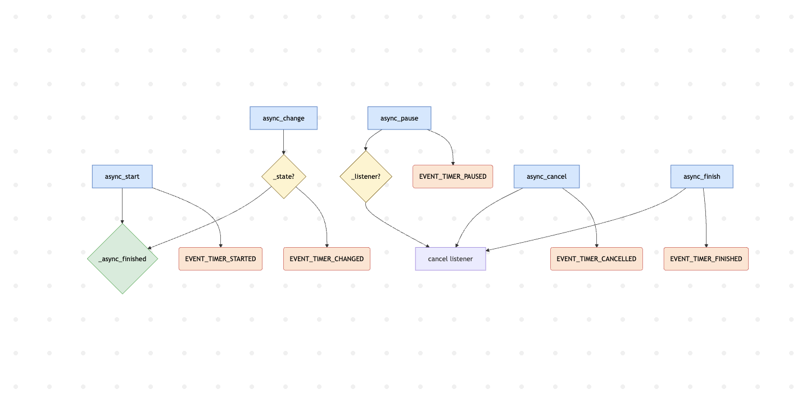

# 1. Addressed Component/Module/Part of the System

### Component: **Timer Component**
### Location: **homeassistant/components/timer/**
### Analysis **Type: Call Graph**

The Timer component manages countdowns in Home Assistant. It supports start, pause, cancel, finish, and manual override (async_change()). The timer updates its internal state and fires events on the Home Assistant bus for UI and other integrations.

# 2. The Graph and Its Completeness

## Graph Description:
This call graph shows the complete execution flow of the Timer component, from user-triggered start to finish, including pause, cancel, and manual time changes.

## Key Components Analyzed:

## Initialization Phase:
	1.	`async_setup()` — setup and registration of services (start, pause, cancel, finish, change)
	2.	`Timer.from_storage() ` — creating Timer instances

## Execution Phase:
### 1. Start Timer:
        •	`async_start(duration)`
	    •	`_state = STATUS_ACTIVE`
	    •	`_end and _remaining set`
	    •	`async_write_ha_state()`
	    •	`bus.async_fire(EVENT_TIMER_STARTED)`
	    •	`async_track_point_in_utc_time() registers _async_finished()`
### 2. Pause Timer:
        •	`async_pause()`
	    •	`cancel _listener()`
	    •	`calculate _remaining`
	    •	`_state = STATUS_PAUSED`
	    •	`fire EVENT_TIMER_PAUSED`
### 3. Cancel Timer:
        •	`async_cancel()`
	    •	`reset _state, _remaining, _end`
	    •	`reset _running_duration`
	    •	`fire EVENT_TIMER_CANCELLED`
### 4. Finish Timer:
    	•	`a`sync_finish()` or `_async_finished()`
	    •	`reset _state, _remaining`, `_end`, `_running_duration`
	    •   `fire EVENT_TIMER_FINISHED`
### 5. Change Timer:
    	•	`async_change(duration)`
	    •	check active state
	    •	calculate new `_remaining`
	    •	cancel old `_listener()`
	    •	update `_end` and `_remaining`
	    •	write state + fire `EVENT_TIMER_CHANGED`
	    •	register new listener `_listener = async_track_point_in_utc_time()`

## Graph Characteristics 
### Nodes: **6 main functions `(async_start, async_pause, async_cancel, async_finish, _async_finished, async_change)`**
### Edges: **8 direct function calls, including listener registration and bus events**
### Decision Points: **3 critical points (state check, duration check, remaining time validation)**
### External Dependencies: **Home Assistant bus, `async_track_point_in_utc_time`, RestoreEntity**

# 3. Impact or Insights Gained from the Analysis
## Key Dependencies Identified:
	•	`_listener` and `async_track_point_in_utc_time` — critical for timer completion
	•	`bus.async_fire()` — notifies external systems
	•	`_running_duration`, `_remaining`, `_end` — internal timer state
	•	Config (yaml or storage) for state restoration

## Impact of Changes:
### High-Impact Changes (Ripple > 5 modules):
	    Changes in `async_change()` affect `_async_finished`, events, state updates, and listener registration
	    Changes in `_async_finished()` or `async_finish()` affect all timer completions and events
### Medium-Impact Changes (Ripple 3-5 modules):
	    Changes in `async_start(), `async_pause()`, `async_cancel()` affect `_state`, `_remaining`, and bus events
### Low-Impact Changes (Ripple < 3 modules):
	    Logging via `_LOGGER`
	    Time formatting `_format_timedelta`

## Potential Risks Identified:
### Critical Risks:
	    Timer may finish early if `_async_finished()` does not trigger correctly
	    Race conditions on simultaneous calls to `async_change()` or `async_pause()`
### Performance Risks:
	    Large number of timers and bus events may slow down the system

# Conclusion:
The Timer component has a clear structure with phases: start, pause, cancel, finish, and manual override. It is tightly coupled to the Home Assistant bus and internal state. Critical points include timer completion and remaining time adjustment. Any changes in these functions will have wide ripple effects across the timer flow.