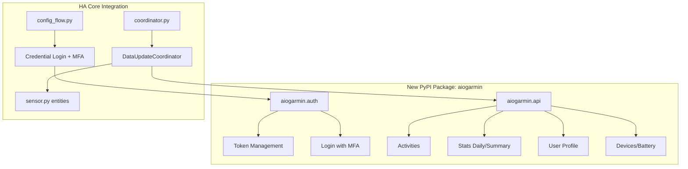
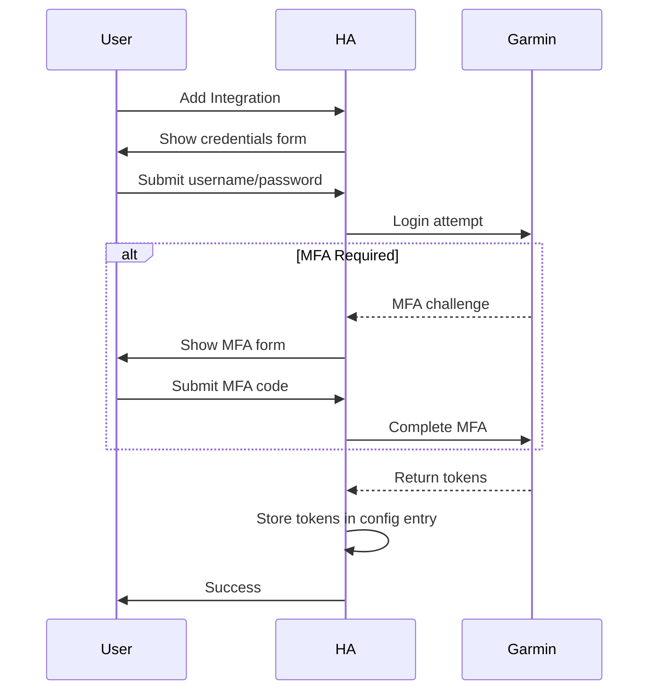

# Garmin Connect Core Integration - Implementation Plan

## Problem Description

Convert existing HACS garmin_connect integration to Home Assistant Core. User wants to create a **new HA-specific async library** that:

- Uses `aiohttp` with HA websession injection
- Supports only API endpoints used by the integration
- Fits HA's OAuth patterns (token storage, refresh)
- Is fully async

## User Review Required

> [!IMPORTANT] > **Library Naming Decision**
>
> Suggested name: `aiogarmin` or `garmin-connect-ha`
>
> This would be a separate PyPI package that the core integration depends on.

---

## Architecture Overview



---

## Phase 1: Create `aiogarmin` Library

### Library Structure

```
aiogarmin/
├── __init__.py
├── auth.py           # OAuth1/2 token handling, login, MFA
├── client.py         # Main async client class
├── const.py          # Garmin API URLs, endpoints
├── exceptions.py     # GarminAuthError, GarminAPIError
└── models.py         # Pydantic models for API responses
```

### Key Design Decisions

| Aspect            | Approach                                                          |
| ----------------- | ----------------------------------------------------------------- |
| **HTTP Client**   | Accept `aiohttp.ClientSession` via injection (HA websession)      |
| **Token Storage** | Return tokens to caller (HA stores in config entry)               |
| **Token Refresh** | Library handles internally, notifies caller of new tokens         |
| **MFA Flow**      | Two-step: login returns "mfa_required", then `complete_mfa(code)` |
| **API Scope**     | Only endpoints used by garmin_connect integration                 |

### Auth Module (`auth.py`)

```python
class GarminAuth:
    """Handle Garmin SSO authentication."""

    def __init__(
        self,
        session: aiohttp.ClientSession,
        oauth1_token: str | None = None,
        oauth2_token: str | None = None,
    ):
        self._session = session
        self._oauth1_token = oauth1_token
        self._oauth2_token = oauth2_token

    async def login(
        self,
        username: str,
        password: str
    ) -> AuthResult:
        """Login with credentials. Returns tokens or MFA challenge."""
        ...

    async def complete_mfa(self, mfa_code: str) -> AuthResult:
        """Complete MFA and return tokens."""
        ...

    async def refresh_tokens(self) -> AuthResult:
        """Refresh OAuth2 token using OAuth1."""
        ...
```

### Client Module (`client.py`)

```python
class GarminConnectClient:
    """Async Garmin Connect API client."""

    def __init__(
        self,
        session: aiohttp.ClientSession,
        auth: GarminAuth,
    ):
        self._session = session
        self._auth = auth

    async def get_user_summary(self, date: date) -> UserSummary:
        """Get daily summary stats."""
        ...

    async def get_activities(self, limit: int = 10) -> list[Activity]:
        """Get recent activities."""
        ...

    async def get_body_battery(self, date: date) -> list[BodyBattery]:
        """Get body battery data."""
        ...

    # ... other endpoints as needed
```

---

## Phase 2: Core Integration Structure

### Files in `homeassistant/components/garmin_connect/`

| File             | Purpose                                           |
| ---------------- | ------------------------------------------------- |
| `manifest.json`  | `requirements: ["aiogarmin==x.x.x"]`              |
| `__init__.py`    | Setup entry, inject websession, store coordinator |
| `config_flow.py` | Credential login with MFA step                    |
| `coordinator.py` | `DataUpdateCoordinator` using aiogarmin client    |
| `sensor.py`      | Sensor entities from descriptions                 |
| `const.py`       | DOMAIN, config keys                               |
| `strings.json`   | UI translations                                   |

### Config Entry Data Structure

```python
# Stored in entry.data
{
    "oauth1_token": "...",      # Long-lived (1 year)
    "oauth2_token": "...",      # Short-lived (auto-refresh)
    "user_id": "...",           # Unique ID
}
```

### Config Flow Steps



---

## API Endpoints to Support

Based on current integration usage:

| Endpoint                                                    | Data             |
| ----------------------------------------------------------- | ---------------- |
| `GET /usersummary-service/usersummary/daily/{displayName}`  | Daily stats      |
| `GET /activitylist-service/activities/search/activities`    | Activities list  |
| `GET /activity-service/activity/{activityId}/details`       | Activity details |
| `GET /wellness-service/wellness/bodyBattery/forDate/{date}` | Body battery     |
| `GET /hrv-service/hrv/{date}`                               | HRV data         |
| `GET /device-service/deviceservice/device-info/all`         | Devices          |
| `GET /userprofile-service/socialProfile`                    | User profile     |

---

## Verification Plan

### Library Tests

```bash
# In aiogarmin repo
pytest tests/ -v --cov=aiogarmin
```

### Integration Tests

```bash
# In HA core
pytest tests/components/garmin_connect/ -v
```

### Manual Testing

1. Install integration via UI
2. Test login with MFA
3. Verify sensors populate
4. Test token refresh (wait for expiry or mock)
5. Test reauth flow

---

## Questions for User

1. **Library name preference**: `aiogarmin`, `garmin-connect-aio`, or other?

2. **Separate repo**: Create new repo `cyberjunky/aiogarmin` for the library?

3. **Initial API scope**: Should we start minimal (daily summary + activities) and expand later?

4. **Token format**: The garth library uses OAuth1+OAuth2 hybrid - should we replicate this or simplify?
