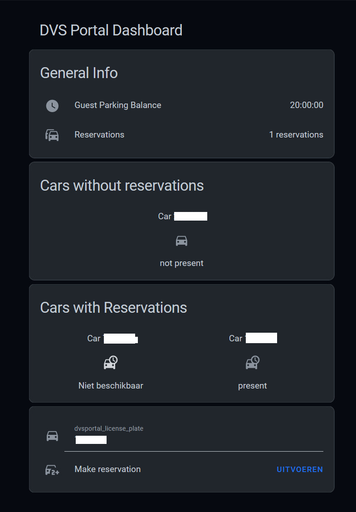

# DVS Portal Integration for Home Assistant

This integration is designed for the parking system used by several Dutch municipalities. It provides sensors and functionalities to interact with the parking system directly from your Home Assistant instance.

If your parking system has "DVSPortal" in the URL, you can use this integration. [Search for examples here](https://www.google.com/search?q=inurl%3Advsportal).



[Read here how to set up your dashboard](DASHBOARD.md)

---

## 📚 **About DVSPortal**

The **DVSPortal Integration** allows you to connect with parking services offered by municipalities using the DVSPortal system.
DVSPortal is a web-based service used to manage guest parking, view parking balances, and handle car reservations efficiently.

For more information about DVSPortal, please visit the official website (if available) or check with your local municipality for access details.

---

## 🚀 **Features**

- **Balance Sensor**: Shows the remaining balance for guest parking.
- **Active Reservations Sensor**: Displays the number of active and future reservations.
- **Car Sensors**: Dynamic sensors for each known license plate, showing its current state.
- **Service Actions**: Create and end parking reservations via Home Assistant services.

---

## 🛠️ **Prerequisites**

Before installing the integration, ensure you have the following:

1. Access to the DVSPortal website (e.g., `https://parkeren.gemeente.nl`).
2. Your **username** and **password** for DVSPortal.
3. Optionally, an **API User Agent string** (if required by your municipality's DVSPortal setup).

---

## 📥 **Installation**

1. Go to **Settings > Devices & Services > Add Integration**.
2. Search for **"DVSPortal"**.
3. Enter your **host URL**, **username**, **password**, and optional **User Agent string**.
4. Complete the setup wizard.

---

## Removing the integration

This integration follows standard integration removal. No extra steps are required.

---

## 📊 **Sensors**

### **Balance Sensor**
- **State**: Remaining balance in minutes.
- **Attributes**: Additional information about the balance.

### **Active Reservations Sensor**
- **State**: Total number of active and future reservations.
- **Attributes**:
   - `current_reservations`: List of active license plates.
   - `future_reservations`: List of future reservations.

### **Car Sensors**
- **State**: Can be one of the following:
  - `not present`: No active reservation.
  - `present`: Currently has an active reservation.
  - `reserved`: Has a future reservation.
- **Attributes**:
  - `license_plate`: The license plate number.
  - `name`: Name associated with the license plate.
  - `previous_reservation_start`: Start time of the previous reservation.
  - `previous_reservation_end`: End time of the previous reservation.

---

## ⚙️ **Service Actions**

The integration provides the following service actions:

### **Action: Create Reservation**

The `dvsportal.create_reservation` service creates a new parking reservation.

| Data Attribute        | Optional | Description                                        |
|------------------------|----------|----------------------------------------------------|
| `entry_id`            | No       | The ID of the config entry to use for this action. |
| `entity_id`           | Yes      | The entity ID of the car sensor.                  |
| `license_plate_value` | Yes      | The license plate value to reserve.               |
| `license_plate_name`  | Yes      | A name for the reservation.                       |
| `date_from`           | Yes      | Start date and time (ISO8601 format).             |
| `date_until`          | Yes      | End date and time (ISO8601 format).               |

**Example:**
```yaml
service: dvsportal.create_reservation
data:
  entry_id: "12345"
  license_plate_value: "AB-123-CD"
  license_plate_name: "Guest Car"
  date_from: "2024-01-01T10:00:00"
  date_until: "2024-01-01T12:00:00"
```

### **Action: End Reservation**

The `dvsportal.end_reservation` service ends an active parking reservation.

| Data Attribute | Optional | Description                                        |
|-----------------|----------|----------------------------------------------------|
| `entry_id`     | No       | The ID of the config entry to use for this action. |
| `entity_id`    | No       | The entity ID of the car sensor.                   |

**Example:**
```yaml
service: dvsportal.end_reservation
data:
  entry_id: "12345"
  entity_id: "sensor.dvsportal_car_abc123"
```

---

## 🤝 **Credits**

This integration was built upon the DVSPortal API implementation by [tcoenraad](https://github.com/tcoenraad).
The original Python API wrapper can be found [here](https://github.com/tcoenraad/python-dvsportal).

---

## 👤 **Author**

This integration was created by [chessspider](https://github.com/chessspider).

---

## 🐞 **Issues and Contributions**

For issues, feature requests, and contributions, please use the [GitHub Issue Tracker](https://github.com/chessspider/dvsportal/issues).

---

## 📝 **Additional Resources**

- [Home Assistant Documentation](https://www.home-assistant.io/)
- [DVSPortal API Documentation](https://github.com/tcoenraad/python-dvsportal)
- [Custom Dashboard Guide](DASHBOARD.md)

---

Thank you for using the DVSPortal Integration for Home Assistant! 🚗✨
