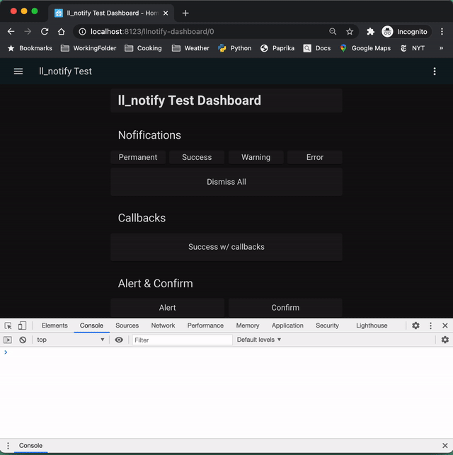

# Lovelace Notify / ll_notify

ll_notify is a Home Assistant component that allows you to easily add notifications and alerts to a Lovelace dashboard.

ll_notify is basically thin wrapper on top of the Javascript framework [AlertifyJS](https://alertifyjs.com/). It has a backend (python) component, auto-loads to the front-end, and has a JS wrapper in the Lovlace user interface. You can trigger a notification by calling a backend service. (eg: `call-service: ll_notify/success`)



## Status: Alpha

This is still in development mode. I'm trying to decide if I should do a PR to HACore (to become a builtin component) or if it should be a custom component.

As a custom component, it's probably pretty close to prime-time. But for a builtin, it would require docs, code cleanup, more robust exception handling, and testing.

## Installation

```bash
cd config/custom_components
git clone git@github.com:rr326/ha_ll_notify.git ll_notify
echo "Please restart Home Assistant"
```

### Test it

In your Home Assistant Dashboard, got to Developer Tools > Services. Under services, select "ll_notify.success". Click "Fill Example Data" from the box below. Then click the "Call Service" button. If a notification appears on the screen, you are set.

If not, in your dashboard open your browser [developer tools](https://balsamiq.com/support/faqs/browserconsole/) window. At the top of the window you should see something like, 'll_notify: Successfully loaded.' If not, make sure you installed it properly. Check your HA logs. Or file an issue here.

## Config

```yaml
# config/configuration.yaml

ll_notify:  # required
  defaults: # optional. Full list here: https://alertifyjs.com/guide.html#defaults
    notifier:
      position: bottom-right
```

### Dashboard

```yaml
# In a dashboard

# Simple
  - type: button
    name: Success
    tap_action:
        action: call-service
        service: ll_notify.success
        service_data:
            message: "Test success"
            wait: 2

# Complicated - with "callbacks"
  - type: button
    name: Success w/ callbacks
    tap_action:
        action: call-service
        service: ll_notify.success
        service_data:
            message: "Success w/ callbacks"
            wait: 1
            after_close:
                - action: call_service
                domain: ll_notify
                service: ping
                service_data:
                    field1: val1
                - action: fire_event
                event_name: fake_event
                event_data:
                    field1: val1
                - action: js_fire_event
                event_name: fake_js_event
                event_data:
                    field1: val1
```

### Elsewhere
`ll_notify` exposes several services and you can trigger notifications wherever you like. See below.

## Exposed services

DOMAIN: `ll_notify`

### Services

* success
* error
* warning
* message
* notify
* alert
* confirm
* dismiss_all

## Actions / "callbacks"

Alertify uses callbacks after a notification is dismissed, or after a confirm dialog is accepted or rejected. ll_notify instead implements 3 types of actions:

1. `call_service` - Call a hass service
2. `fire_event` - Fire a hass event
3. `js_fire_event` - Fire a Javascript event, solely in the browser.

You can trigger one action, or multiple actions. See the example dashboard above.

## Missing Alertify features

Every AlertifyJS feature has not been implemented.

Alertify's [notifications](https://alertifyjs.com/notifier.html) are implemented fully and are quite easy to use.

Aleritify's [alerts](https://alertifyjs.com/alert.html) and [confirm dialogs](https://alertifyjs.com/confirm.html) are also implemented. You can set all the properties by sending key:value pairs in `service_data`, but most of the methods are not implemented.

Alertify's [prompt](https://alertifyjs.com/prompt.html) is not implemented at all. It is unclear that the benefit is worth the complications.
