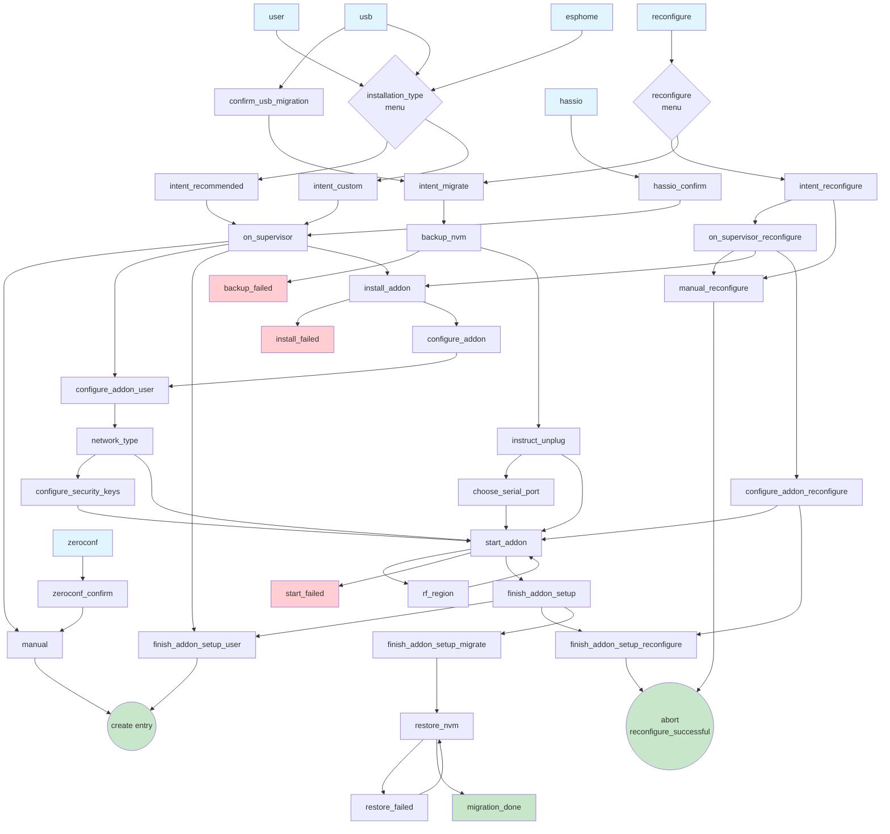
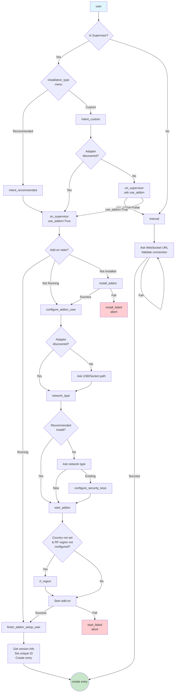
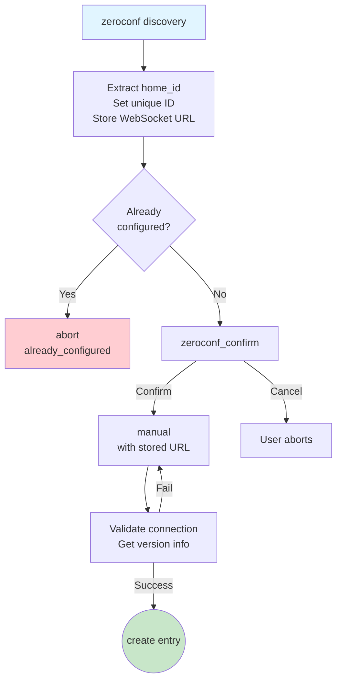
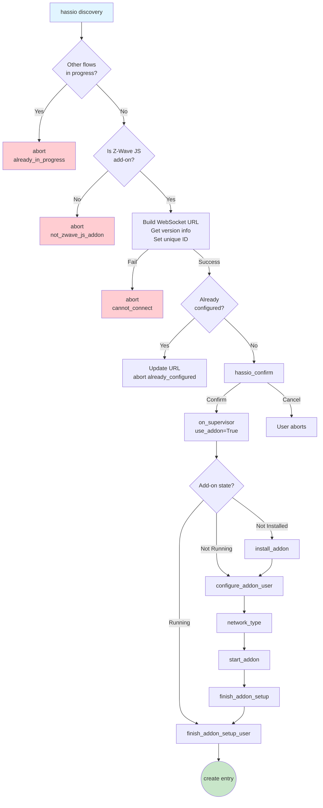
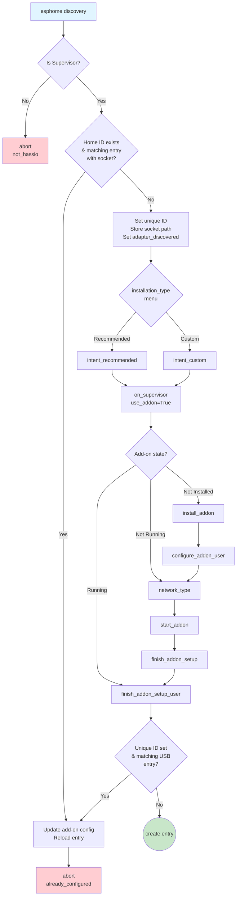
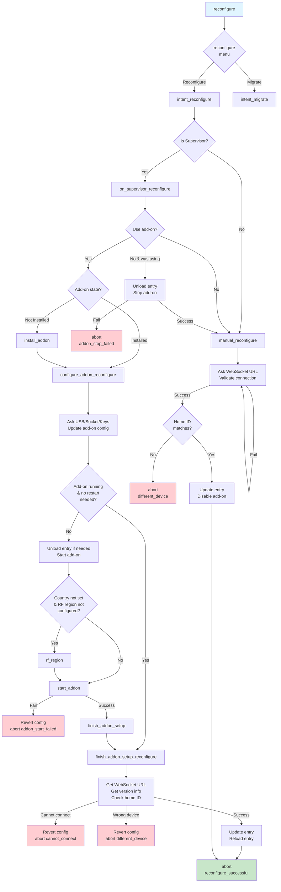
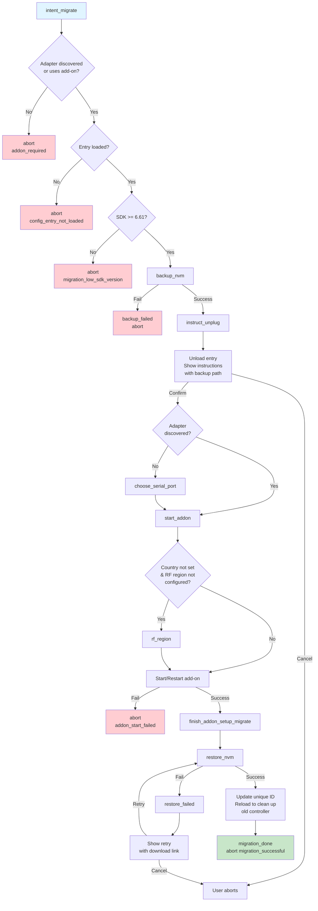

# Z-Wave Integration

This document covers details that new contributors may find helpful when getting started.

## Improving device support

This section can help new contributors learn how to improve Z-Wave device support within Home Assistant.

The Z-Wave integration uses a discovery mechanism to create the necessary entities for each of your Z-Wave nodes. To perform this discovery, the integration iterates through each node's [Values](https://zwave-js.github.io/node-zwave-js/#/api/valueid) and compares them to a list of [discovery rules](./discovery.py). If there is a match between a particular discovery rule and the given Value, the integration creates an entity for that value using information sent from the discovery logic to indicate entity platform and instance type.

In cases where an entity's functionality requires interaction with multiple Values, the discovery rule for that particular entity type is based on the primary Value, or the Value that must be there to indicate that this entity needs to be created, and then the rest of the Values required are discovered by the class instance for that entity. A good example of this is the discovery logic for the `climate` entity. Currently, the discovery logic is tied to the discovery of a Value with a property of `mode` and a command class of `Thermostat Mode`, but the actual entity uses many more Values than that to be fully functional as evident in the [code](./climate.py).

There are several ways that device support can be improved within Home Assistant, but regardless of the reason, it is important to add device specific tests in these use cases. To do so, add the device's data to the [fixtures folder](../../../tests/components/zwave_js/fixtures) and then define the new fixtures in [conftest.py](../../../tests/components/zwave_js/conftest.py). Use existing tests as the model but the tests can go in the [test_discovery.py module](../../../tests/components/zwave_js/test_discovery.py). To learn how to generate fixtures, see the following section.

### Generating device fixtures

To generate a device fixture, download a diagnostics dump of the device from your Home Assistant instance. The dumped data will need to be modified to match the expected format. You can always do this transformation by hand, but the integration provides a [helper script](scripts/convert_device_diagnostics_to_fixture.py) that will generate the appropriate fixture data from a device diagnostics dump for you. To use it, run the script with the path to the diagnostics dump you downloaded:

`python homeassistant/components/zwave_js/scripts/convert_device_diagnostics_to_fixture.py <path/to/diagnostics/dump>`

The script will print the fixture data to standard output, and you can use Unix piping to create a file from the fixture data:

`python homeassistant/components/zwave_js/scripts/convert_device_diagnostics_to_fixture.py <path/to/diagnostics/dump> > <path_to_fixture_output>`

You can alternatively pass the `--file` flag to the script and it will create the file for you in the [fixtures folder](../../../tests/components/zwave_js/fixtures):
`python homeassistant/components/zwave_js/scripts/convert_device_diagnostics_to_fixture.py <path/to/diagnostics/dump> --file`

### Switching HA support for a device from one entity type to another.

Sometimes manufacturers don't follow the spec properly and implement functionality using the wrong command class, resulting in HA discovering the feature as the wrong entity type. There is a section in the [discovery rules](./discovery.py) for device specific discovery. This can be used to override the type of entity that HA discovers for that particular device's primary Value.

### Adding feature support to complex entity types

Sometimes the generic Z-Wave entity logic does not provide all of the features a device is capable of. A great example of this is a climate entity where the current temperature is determined by one of multiple sensors that is configurable by a configuration parameter. In these cases, there is a section in the [discovery rules](./discovery.py) for device specific discovery. By leveraging [discovery_data_template.py](./discovery_data_template.py), it is possible to create the same entity type but with different logic. Generally, we don't like to create entity classes that are device specific, so this mechanism allows us to generalize the implementation.

## Architecture

This section describes the architecture of Z-Wave JS in Home Assistant and how the integration is connected all the way to the Z-Wave USB stick controller.

### Connection diagram

![alt text][connection_diagram]

#### Z-Wave USB stick

Communicates with devices via the Z-Wave radio and stores device pairing.

#### Z-Wave JS

Represents the USB stick serial protocol as devices.

#### Z-Wave JS Server

Forward the state of Z-Wave JS over a WebSocket connection.

#### Z-Wave JS Server Python

Consumes the WebSocket connection and makes the Z-Wave JS state available in Python.

#### Z-Wave integration

Represents Z-Wave devices in Home Assistant and allows control.

#### Home Assistant

Best home automation platform in the world.

### Running Z-Wave JS Server

![alt text][running_zwave_js_server]

Z-Wave JS Server can be run as a standalone Node app.

It can also run as part of Z-Wave JS UI, which is also a standalone Node app.

Both apps are available as Home Assistant add-ons. There are also Docker containers etc.

[connection_diagram]: docs/z_wave_js_connection.png "Connection Diagram"
[//]: # (https://docs.google.com/drawings/d/10yrczSRwV4kjQwzDnCLGoAJkePaB0BMVb1sWZeeDO7U/edit?usp=sharing)

[running_zwave_js_server]: docs/running_z_wave_js_server.png "Running Z-Wave JS Server"
[//]: # (https://docs.google.com/drawings/d/1YhSVNuss3fa1VFTKQLaACxXg7y6qo742n2oYpdLRs7E/edit?usp=sharing)

## Config Flow

This section documents the Z-Wave JS integration config flow, showing how different entry points and steps interact.

Below is a diagram showing all steps and descriptions of each step. Afterwards, each entry point and step is described in detail.

### Step Descriptions

#### Entry Points

- **`user`**
  - Entry point when user manually adds the integration through UI
  - Checks if running on Home Assistant Supervisor (Supervisor OS/Container)
  - If on Supervisor: shows `installation_type` menu
  - If not on Supervisor: goes directly to `manual` step

- **`zeroconf`**
  - Entry point for Zeroconf/mDNS discovered Z-Wave JS servers
  - Extracts `homeId` from discovery properties and sets as unique ID
  - Aborts if already configured with same home ID
  - Builds WebSocket URL from discovered host:port
  - Shows `zeroconf_confirm` to user

- **`usb`**
  - Entry point for USB-discovered Z-Wave controllers
  - Only works on Home Assistant Supervisor (aborts with `discovery_requires_supervisor` otherwise)
  - Allows multiple USB flows in progress (for migration scenarios)
  - Filters out 2652 Zigbee sticks that share same VID/PID with some Z-Wave sticks
  - Converts device path to `/dev/serial/by-id/` format for stability
  - Checks if device is already configured in add-on
  - Sets temporary unique ID based on USB identifiers
  - If existing entries found: looks for add-on entry to enable migration
  - If no existing entries: goes to new setup flow

- **`hassio`**
  - Entry point when Z-Wave JS add-on announces itself via Supervisor discovery
  - Validates this is the official Z-Wave JS add-on (checks slug)
  - Builds WebSocket URL from discovery config
  - Gets version info and home ID from server
  - Sets unique ID to home ID
  - If already configured: updates URL and aborts
  - If new: shows `hassio_confirm`

- **`esphome`**
  - Entry point for ESPHome devices with Z-Wave over socket support
  - Only works on Home Assistant Supervisor
  - Special handling if home ID exists in discovery:
    - Looks for existing entry with matching home ID
    - If entry uses socket connection: updates add-on config with new socket path and reloads
  - Sets unique ID to home ID
  - Stores socket path from discovery
  - Sets `_adapter_discovered` flag to skip manual device selection
  - Goes to `installation_type` menu

- **`reconfigure`**
  - Entry point when user reconfigures existing config entry
  - Stores reference to config entry being reconfigured
  - Shows menu with two options:
    - `intent_reconfigure`: Change connection settings
    - `intent_migrate`: Migrate to different controller hardware

#### Menu Steps

- **`installation_type`**
  - Menu shown on Supervisor when setting up integration
  - Options:
    - `intent_recommended`: Guided setup with add-on (auto-configures everything)
    - `intent_custom`: Advanced setup (choose add-on or manual server)

#### Intent Steps

- **`intent_recommended`**
  - User selected recommended installation
  - Sets `_recommended_install` flag for automatic configuration
  - Forces add-on usage: calls `on_supervisor` with `use_addon=True`

- **`intent_custom`**
  - User selected custom installation
  - If adapter was discovered (USB/ESPHome): forces add-on usage
  - If no adapter discovered: goes to `on_supervisor` to ask user preference

- **`intent_reconfigure`**
  - User wants to reconfigure connection settings (not migrate hardware)
  - Checks if on Supervisor:
    - Yes: goes to `on_supervisor_reconfigure`
    - No: goes to `manual_reconfigure`

- **`intent_migrate`**
  - User wants to migrate to different Z-Wave controller hardware
  - Validates requirements:
    - Adapter must be discovered OR existing entry must use add-on
    - Config entry must be loaded (needs access to driver)
    - Controller SDK version must be >= 6.61 (older versions don't support NVM export)
  - Sets `_migrating` flag
  - Starts migration: goes to `backup_nvm`

#### Configuration Steps - Supervisor Add-on Path

- **`on_supervisor`**
  - Asks user if they want to use the Z-Wave JS add-on or manual server
  - If user_input is None: shows form with checkbox for `use_addon` (default: True)
  - If `use_addon=False`: goes to `manual` step
  - If `use_addon=True`:
    - Gets add-on info and checks state
    - If add-on running: loads config from add-on, goes to `finish_addon_setup_user`
    - If add-on not running: goes to `configure_addon_user`
    - If add-on not installed: goes to `install_addon`

- **`configure_addon_user`**
  - Collects USB path or ESPHome socket path for add-on
  - If adapter was discovered: skips asking, uses stored path
  - If no adapter discovered: shows form with:
    - Optional USB path dropdown (populated from available USB ports)
    - Optional socket path text field (for ESPHome or remote sockets)
  - Goes to `network_type`

- **`network_type`**
  - Asks if creating new Z-Wave network or using existing network
  - If recommended install: automatically selects "new" (generates new keys)
  - Shows form with options:
    - `new`: Generate new security keys (blank keys)
    - `existing`: Import existing network keys
  - If new: clears all security keys and goes to `start_addon`
  - If existing: goes to `configure_security_keys`

- **`configure_security_keys`**
  - Collects security keys for existing Z-Wave network
  - Shows form with optional fields for:
    - S0 Legacy Key (32 hex chars)
    - S2 Unauthenticated Key (32 hex chars)
    - S2 Authenticated Key (32 hex chars)
    - S2 Access Control Key (32 hex chars)
    - Long Range S2 Authenticated Key (32 hex chars)
    - Long Range S2 Access Control Key (32 hex chars)
  - Pre-populates with existing add-on config if available
  - Stores keys in config flow state
  - Goes to `start_addon`

- **`rf_region`**
  - Asks user to select RF region for Z-Wave controller
  - Only shown if:
    - Home Assistant country is not set
    - Add-on RF region is not configured or set to "Automatic"
  - Shows dropdown with regions:
    - Australia/New Zealand, China, Europe, Hong Kong, India, Israel, Japan, Korea, Russia, USA
  - Stores selected region in add-on config updates
  - Returns to `start_addon`

#### Configuration Steps - Manual Server Path

- **`manual`**
  - Collects WebSocket URL for external Z-Wave JS server
  - Shows form with text field for URL (default: `ws://localhost:3000`)
  - Validates input:
    - URL must start with `ws://` or `wss://`
    - Attempts connection to get version info
  - On success:
    - Sets unique ID to home ID from server
    - If already configured: updates URL and aborts
    - If new: creates config entry
  - On error: shows error message and re-displays form

#### Progress Steps

- **`install_addon`**
  - Progress step that installs Z-Wave JS add-on
  - Creates background task to install add-on via Supervisor API
  - Shows progress spinner to user
  - On success:
    - Sets `integration_created_addon` flag (for cleanup on removal)
    - Goes to `configure_addon`
  - On failure: goes to `install_failed`

- **`install_failed`**
  - Add-on installation failed
  - Aborts flow with reason `addon_install_failed`

- **`start_addon`**
  - Progress step that starts or restarts Z-Wave JS add-on
  - First checks if RF region needs to be selected:
    - If country not set AND RF region not configured: goes to `rf_region`
  - If there are pending add-on config updates: applies them before starting
  - Creates background task (`_async_start_addon`):
    - Starts or restarts add-on via Supervisor API
    - Polls for up to 200 seconds (40 rounds × 5 seconds) waiting for server to respond
    - Gets WebSocket URL from add-on discovery info
    - Validates connection by getting version info
  - On success: goes to `finish_addon_setup`
  - On failure: goes to `start_failed`

- **`start_failed`**
  - Add-on start/restart failed
  - If migrating: aborts with `addon_start_failed`
  - If reconfiguring: calls `async_revert_addon_config` to restore original config
  - Otherwise: aborts with `addon_start_failed`

- **`backup_nvm`**
  - Progress step that backs up Z-Wave controller NVM (non-volatile memory)
  - Creates background task (`_async_backup_network`):
    - Gets driver controller from config entry runtime data
    - Registers progress callback to forward backup progress to UI (0-100%)
    - Calls `controller.async_backup_nvm_raw()` to get raw NVM binary data
    - Saves backup to file: `~/.homeassistant/zwavejs_nvm_backup_YYYY-MM-DD_HH-MM-SS.bin`
  - On success: goes to `instruct_unplug`
  - On failure: goes to `backup_failed`

- **`backup_failed`**
  - NVM backup failed
  - Aborts migration with reason `backup_failed`

- **`restore_nvm`**
  - Progress step that restores NVM backup to new controller
  - Creates background task (`_async_restore_network_backup`):
    - Sets `keep_old_devices` flag to preserve device customizations
    - Reloads config entry to reconnect to new controller
    - Registers progress callbacks for convert (50%) and restore (50%) phases
    - Calls `controller.async_restore_nvm()` with backup data
    - Waits for driver ready event (with timeout)
    - Gets new version info and updates config entry unique ID to new home ID
    - Reloads entry again to clean up old controller device
  - On success: goes to `migration_done`
  - On failure: goes to `restore_failed`

- **`restore_failed`**
  - NVM restore failed
  - Shows form with:
    - Error message
    - Backup file path
    - Download link for backup file (base64 encoded)
    - Retry button
  - If user retries: goes back to `restore_nvm`

#### Finish Steps

- **`configure_addon`**
  - Router step that delegates to appropriate addon configuration
  - If reconfiguring: goes to `configure_addon_reconfigure`
  - Otherwise: goes to `configure_addon_user`

- **`finish_addon_setup`**
  - Router step that delegates to appropriate finish logic
  - If migrating: goes to `finish_addon_setup_migrate`
  - If reconfiguring: goes to `finish_addon_setup_reconfigure`
  - Otherwise: goes to `finish_addon_setup_user`

- **`finish_addon_setup_user`**
  - Finalizes setup for new config entry
  - Gets add-on discovery info if WebSocket URL not set
  - Gets version info from server if not already fetched
  - Sets unique ID to home ID
  - For USB discovery: updates unique ID from temporary USB-based ID to home ID
  - Checks if already configured: updates URL/paths and aborts
  - Creates config entry with all collected data:
    - WebSocket URL
    - USB path
    - Socket path
    - All security keys
    - Add-on flags
  - Aborts any other in-progress flows

#### Confirmation Steps

- **`zeroconf_confirm`**
  - Confirms adding Zeroconf-discovered server
  - Shows form with home ID and WebSocket URL
  - On confirmation: goes to `manual` with pre-filled URL

- **`confirm_usb_migration`**
  - Confirms migrating to newly discovered USB controller
  - Shows form with USB device title
  - On confirmation: goes to `intent_migrate`

- **`hassio_confirm`**
  - Confirms adding add-on discovered server
  - Shows simple confirmation form
  - On confirmation: goes to `on_supervisor` with `use_addon=True`

- **`instruct_unplug`**
  - Instructs user to unplug old controller after backup
  - Unloads config entry before asking (to release USB port)
  - Shows form with backup file path
  - On confirmation:
    - If adapter was discovered: goes to `start_addon` (path already known)
    - If adapter not discovered: goes to `choose_serial_port`

- **`choose_serial_port`**
  - Shows available serial ports for new controller
  - Gets list of USB ports
  - Removes old controller path from list
  - Adds "Use Socket" option for ESPHome/remote connections
  - Shows form with:
    - Optional USB path dropdown
    - Optional socket path text field
  - Stores selected path in add-on config updates
  - Goes to `start_addon`

#### Reconfiguration Steps

- **`on_supervisor_reconfigure`**
  - Asks if user wants add-on or manual server during reconfigure
  - Shows form with `use_addon` checkbox (pre-filled with current value)
  - If `use_addon=False`:
    - If was using add-on: unloads entry and stops add-on
    - Goes to `manual_reconfigure`
  - If `use_addon=True`:
    - If add-on not installed: goes to `install_addon`
    - If add-on installed: goes to `configure_addon_reconfigure`

- **`manual_reconfigure`**
  - Collects new WebSocket URL when reconfiguring manual setup
  - Shows form with URL field (pre-filled with current URL)
  - Validates connection and gets version info
  - Verifies home ID matches existing config entry (prevents wrong device)
  - Updates config entry with new URL
  - Disables add-on handling flags
  - Aborts with `reconfigure_successful`

- **`configure_addon_reconfigure`**
  - Updates add-on configuration during reconfigure
  - Gets current add-on config
  - Shows form with:
    - USB path dropdown (including "Use Socket" option)
    - Socket path text field
    - All six security key fields
  - Pre-fills with current add-on config values
  - On submit:
    - Updates add-on config with new values
    - If add-on running and no restart needed: goes to `finish_addon_setup_reconfigure`
    - Otherwise: unloads entry and goes to `start_addon`

- **`finish_addon_setup_reconfigure`**
  - Finalizes reconfiguration
  - If there's a pending revert reason: reverts config and aborts
  - Gets WebSocket URL from add-on discovery
  - Gets version info from server
  - Verifies home ID matches (prevents wrong device)
  - Updates config entry with all new values
  - Reloads config entry
  - Aborts with `reconfigure_successful`
  - On error: calls `async_revert_addon_config` to restore original config

#### Migration Finish Steps

- **`finish_addon_setup_migrate`**
  - Finalizes migration to new controller
  - Updates config entry with:
    - New WebSocket URL
    - New USB/socket path
    - Same security keys
    - New home ID as unique ID
  - Note: Does NOT reload entry here (done in restore step)
  - Goes to `restore_nvm`

- **`migration_done`**
  - Migration completed successfully
  - Aborts with `migration_successful`

### User Entry Point

Initial setup flow when user manually adds the integration:

### USB Discovery Entry Point

Flow triggered when a USB Z-Wave stick is discovered:

```mermaid
graph TB
    usb[usb discovery] --> supervisor_check{Is Supervisor?}
    supervisor_check -->|No| abort_supervisor[abort<br/>discovery_requires_supervisor]
    supervisor_check -->|Yes| flow_check{Non-USB flows<br/>in progress?}

    flow_check -->|Yes| abort_progress[abort<br/>already_in_progress]
    flow_check -->|No| existing_check{Existing<br/>entries?}

    existing_check -->|No| setup_temp[Set temp unique ID<br/>Store USB path]
    existing_check -->|Yes| find_addon_entry{Entry with<br/>use_addon=True<br/>exists?}

    find_addon_entry -->|No| abort_addon_req[abort<br/>addon_required]
    find_addon_entry -->|Yes| check_configured{Device already<br/>configured in<br/>add-on?}

    check_configured -->|Yes| abort_configured[abort<br/>already_configured]
    check_configured -->|No| setup_temp

    setup_temp --> entries_exist{Existing<br/>entries?}

    entries_exist -->|Yes| confirm_usb_migration[confirm_usb_migration]
    entries_exist -->|No| installation_type{installation_type<br/>menu}

    confirm_usb_migration -->|Confirm| intent_migrate[intent_migrate]
    confirm_usb_migration -->|Cancel| abort_user[User aborts]

    installation_type -->|Recommended| intent_recommended[intent_recommended]
    installation_type -->|Custom| intent_custom[intent_custom]

    intent_recommended --> on_supervisor[on_supervisor<br/>use_addon=True]
    intent_custom --> on_supervisor

    on_supervisor --> addon_state{Add-on state?}
    addon_state -->|Running| finish_addon_setup_user[finish_addon_setup_user]
    addon_state -->|Not Running| network_type[network_type]
    addon_state -->|Not Installed| install_addon[install_addon]

    install_addon --> configure_addon_user[configure_addon_user]
    configure_addon_user --> network_type

    network_type --> recommended{Recommended?}
    recommended -->|Yes| start_addon[start_addon]
    recommended -->|No| ask_network[Ask network type]
    ask_network -->|New| start_addon
    ask_network -->|Existing| configure_security_keys[configure_security_keys]
    configure_security_keys --> start_addon

    start_addon --> rf_check{Country not set<br/>& RF region not<br/>configured?}
    rf_check -->|Yes| rf_region[rf_region]
    rf_check -->|No| start_progress[Start add-on]
    rf_region --> start_progress

    start_progress --> finish_addon_setup[finish_addon_setup]
    finish_addon_setup --> finish_addon_setup_user
    finish_addon_setup_user --> finalize[Update unique ID<br/>Create entry]
    finalize --> create_entry((create entry))

    intent_migrate --> migration_flow[See Migration flow]

    style usb fill:#e1f5ff
    style create_entry fill:#c8e6c9
    style abort_supervisor fill:#ffcdd2
    style abort_progress fill:#ffcdd2
    style abort_addon_req fill:#ffcdd2
    style abort_configured fill:#ffcdd2
    style migration_flow fill:#fff9c4
```

### Zeroconf Discovery Entry Point

Flow triggered when Z-Wave JS server is discovered via Zeroconf:

### Add-on Discovery Entry Point (hassio)

Flow triggered when the Z-Wave JS add-on reports its availability:

### ESPHome Discovery Entry Point

Flow triggered when an ESPHome device with Z-Wave support is discovered:

### Reconfigure Entry Point

Flow triggered when user reconfigures an existing entry:

### Migration Entry Point (intent_migrate)

Flow for migrating from one Z-Wave adapter to another:

